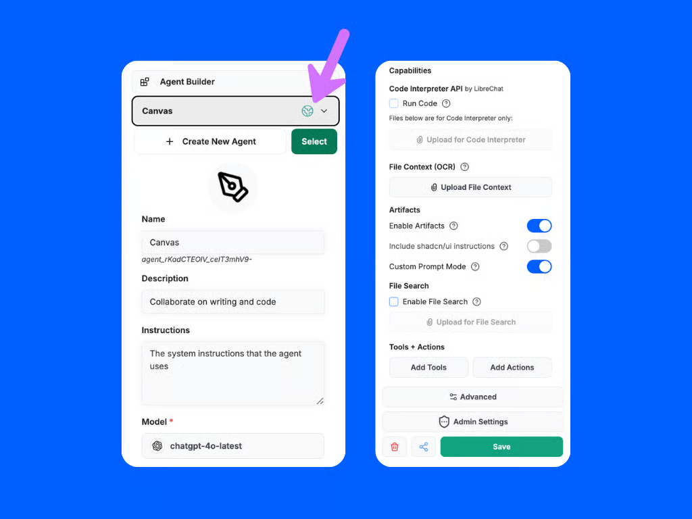

# AI Agents

[AI Agent Feature in Doraverse](./#ai-agent-feature-in-doraverse)

[Step-by-Step Guide to Build Your Own AI Agent in Doraverse](./#step-by-step-guide-to-build-your-own-ai-agent-in-doraverse)

[Why Build AI Agents in Doraverse?](./#why-build-ai-agents-in-doraverse)

## AI Agent Feature in Doraverse

Doraverse’s AI Agent feature lets you design intelligent assistants tailored to your specific tasks or unique workflows — no coding required. Powered by world's best AI models and powerful built-in tools, you can easily create agents with specialized capabilities to support your work, automate tasks, or deliver personalized responses.

## Step-by-Step Guide to Build Your Own AI Agent in Doraverse

***

### 1. **Access** the Agent Builder

Start by selecting **AI Agent** from the navigation sidebar on your home screen.&#x20;

This brings you into the AI Agent space—a central place where you can explore and build your and your team customized AI Agents.&#x20;

You’ll see three organized sections:

* **Recent Agents:** Quickly find AI Agents you've used most recently.
* **Your Agents:** View and manage all agents you’ve personally created.
* **By Your Team:** Discover agents made by your teammates, ready for collaboration.

### To **create a new Agent**

Click the **Create Agent** button located at the top right corner of the screen. This will open the **Agent Builder**, where you can start designing your custom AI Agent from scratch.

### Find Exiting Agents

Existing agents can be selected from the top dropdown of the right Side Panel.

<figure><figcaption></figcaption></figure>

Also by mention with ”@” in the chat input.

<figure><figcaption></figcaption></figure>

***

### 2. Set Up Agent's Profile

The creation of Agent includes:

* **Avatar:** Upload an image to use as your agent’s profile picture, making it easier for your team to recognize and connect with it.
* **Name:** Give your agent a relevant name.
* **Description**: Add a short note describing what this agent is for. Example: “Summarizes meeting transcripts automatically.”
* **Instructions:** System instructions that define your agent’s behavior. You should write out clear directions —how should this agent behave, what should it focus on, any rules it should always follow.
* **Provider & Model:** Choose an AI model that best fits your task from the available list.&#x20;

🤔 Not sure which one to pick? Visit the [**Doraverse's Available AI Models**](https://doraverse.gitbook.io/docs/jp/feature-list/available-ai-models) to see the strengths of each model and find the right match for your needs.

***

### **3.** Set Up **Model Parameters**

Model Parameters are settings that control how your AI agent responds and generates results.&#x20;

By adjusting these values, you can influence the agent’s behavior, such as: how creative it is, how detailed its answers are, or how it interprets your requests. In simple terms, model parameters help you customize how your agent processes information and creates text or images, so the results fit your specific needs.

Want tips on how to adjust your model’s parameters for the best results? Visit our [**Model Parameter Guide**](https://doraverse.gitbook.io/docs/jp/feature-list/ai-agents/ai-model-parameter) for step-by-step instructions and practical examples.

***

### 4. Choose Agent Capabilities

Expand what your Agent can do with powerful capabilities

#### **Code Interpreter**

**What is Code Interpreter?**

A code interpreter is like a smart assistant that understands computer code, so you can get complex computer tasks done just by asking in regular language.

**When Should You Enable Code Interpreter?**

Turn on Code Interpreter if you want your agent to:

* **Execute code in multiple languages:** Work with Python, JavaScript, TypeScript, Go, C, C++, Java, PHP, Rust, and Fortran.
* **Run code with zero setup:** Run code without local setup, configuration, or sandbox deployment.
* **Process files: Agent will** handle and analyze file securely:
  * Work with numbers or perform advanced calculations
  * Analyze data sets or spreadsheets
  * Process files or automate repetitive data work
* **Manage file uploads and downloads:** Easily upload files for processing and download results, making the workflow smooth and efficient.

#### File Search

**What is File Search?**

File Search gives your AI agent the power to rapidly search and understand your uploaded documents. It’s like giving your assistant a supercharged memory—helping you quickly find the right answers and information from all your important files.

**When Should You Enable File Search?**

* **Provide answers using your files:** The agent retrieves facts or details directly from your uploaded documents, making it well-suited for tasks like research, onboarding, or instant knowledge retrieval from your own files.
* **Perform semantic searches:** Go beyond just keywords, the agent can understand the intent and meaning behind your questions.
* **Support Retrieval-Augmented Generation (RAG):** Responses become more accurate and context-aware when referencing your own documents.

#### File Context (OCR)

**What is File Context (OCR)?**

File Context uses Optical Character Recognition (OCR) to let your agent extract and process text from images and scanned document, turning photos, PDFs, or screenshots into readable and actionable text.

**When Should You Enable File Context (OCR)?**

* **Extract text while preserving layout:** Retain tables, columns, and original formatting for easier interpretation.
* **Process complex files:** Handle mixed-content images, invoices, forms, or documents with multiple languages.
* **Read hard-to-access content:** Work with scans, photos, or non-editable PDFs that you normally couldn’t search or analyze.

#### Artifacts (Interactive Outputs)

**What is Artifacts?**

Artifacts lets your agent generate and display interactive or visual results, like diagrams, charts, and code examples—to make responses not just informative, but engaging and visually accessible.

**When Should You Enable Artifacts?**

Enable Artifacts for team presentations, building visual workflows, or explaining complex concepts with engaging visuals:

* **Create visual or interactive outputs:** Auto-generate React components, HTML snippets, or diagrams.
* **Present results visually:** Show content in a focused UI window for greater clarity and interactivity.
* **Customize outputs:** Adjust how the agent produces and displays custom visual or interactive content.

When Artifacts are enabled, the agent automatically includes additional, artifact-specific instructions by default. The options available include:

* **Enable shadcn/ui Instructions:** Adds guidance for using shadcn/ui components—a collection of reusable components built with Radix UI and Tailwind CSS.
* **Custom Prompt Mode:** When this is enabled, the default artifact system prompt is not included, allowing you to provide your own custom instructions.\
  **Note:** If you enable Custom Prompt Mode, be sure to include, at minimum, the basic artifact format in your instructions.

For more details, see [**Agent's Capabilities**](https://doraverse.gitbook.io/docs/jp/feature-list/ai-agents/agents-capabilities).

***

### 5. Add Tools & Actions

Enhance your agent’s capabilities by enabling extra tools:

* **Integrations:** Let your agent access weather, web search, image generation, calculation features, and more. Choose only those relevant to your workflow for a focused, clutter-free experience.

***

### 6. Set Sharing & Permissions

* **Share Your Agent:** Set permissions to either keep your agent private or share it with colleagues.
* **Admin Settings:** If you’re an admin, you can control sharing for everyone across your organization, ensuring sensitive agents stay protected.

***

### 7. Launch: Start Using Your AI Agent

Click **Create** to finish. Your new agent is ready to chat.&#x20;

Find it listed in your AI Agent space, or mention it by typing "@" in the chat.

***

### 💡**Tips**

* You can always edit, update, or duplicate agents as your needs grow.
* Test your agent: Interact with it, provide feedback, and refine its skills as needed.

***

## Why Build AI Agents in Doraverse?

* **No expertise required:** Everything is explained in everyday language, and setup is intuitive.
* **Custom fit:** Create agents for reporting, answering FAQs, extracting insights from files, and more to choose what suits your team best.
* **Result-focused:** Save time, reduce repetitive work, and boost productivity. Your agent works 24/7, tailored to your organization’s needs.

